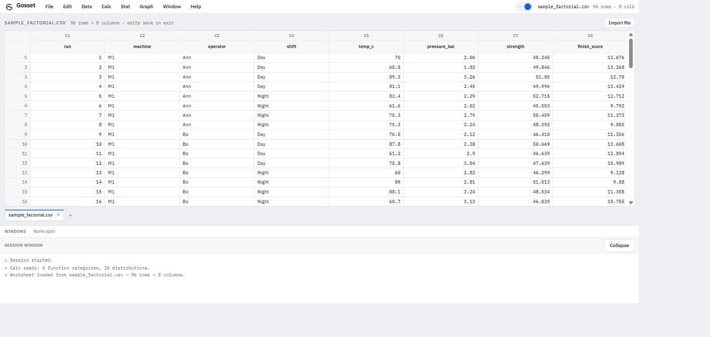
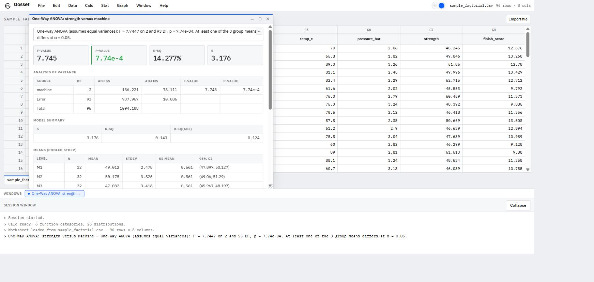
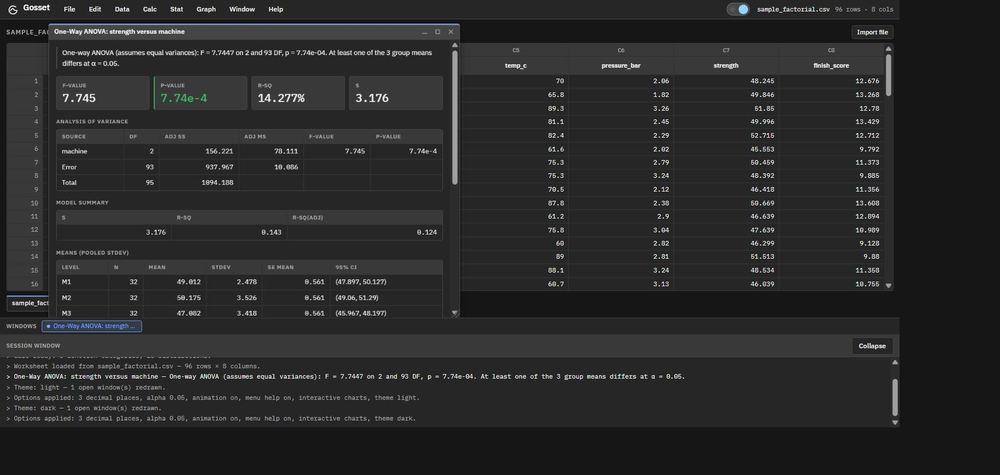
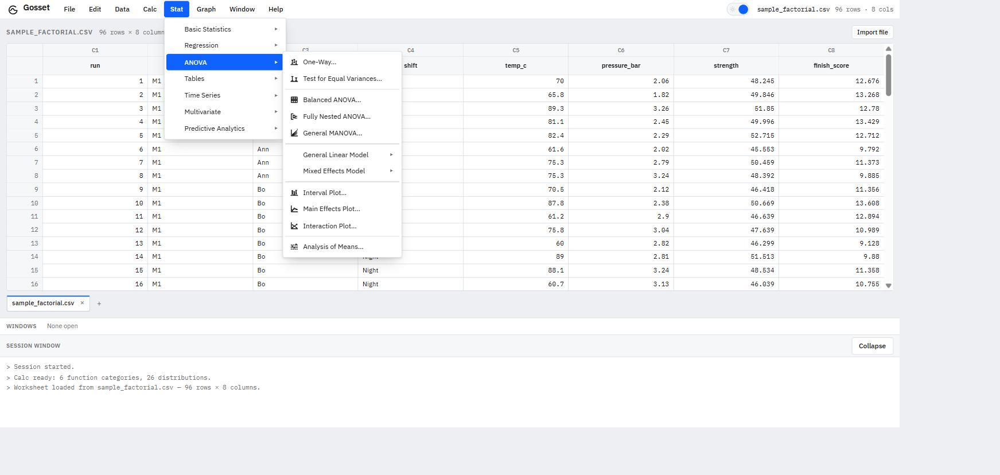
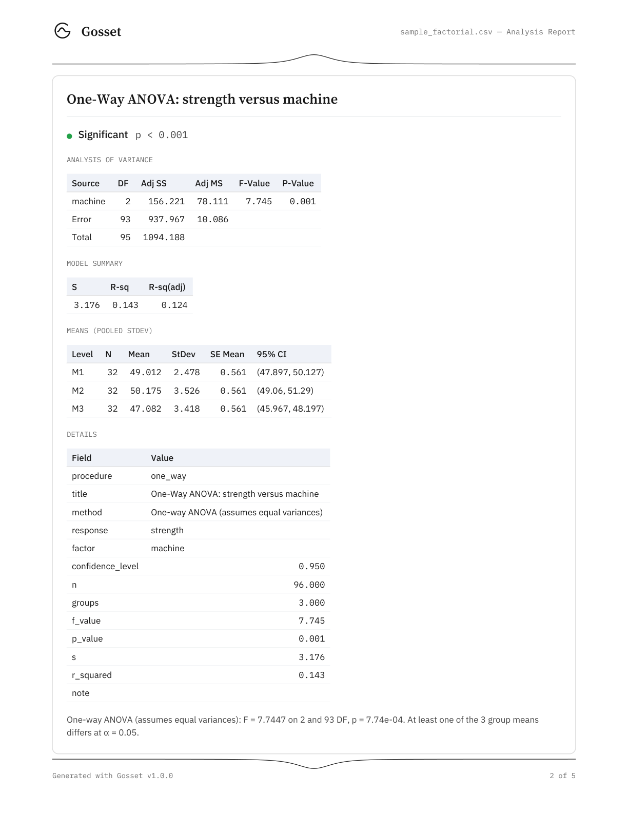

<div align="center">


# Gosset

### A statistical analysis workbench

A desktop application for real statistical work — 239 procedures across Basic Statistics,
Regression, ANOVA, Calc, Data and Graph — that runs entirely on your own machine.
No account, no subscription, no network.

<sub>Named for William Sealy Gosset, who published the t-distribution as "Student" in 1908 —
because his employer would not let him publish under his own name.</sub>

</div>

---

<div align="center">

</div>

## What it is

Gosset is a Minitab-equivalent analytics application. You open a worksheet, choose a procedure from the
menu bar, fill in a dialog, and get a result window with tables, findings and graphs — then export the
session as a typeset PDF, a Word document, an Excel workbook, a PowerPoint deck or Markdown.

Three ideas run through it:

**Every result is a document, not a data dump.** A procedure returns a narrative conclusion, headline
statistics, titled tables and graphs. The PDF export is a designed report — a cover block, one bordered
card per result, a coloured verdict badge, small-caps group labels, monospaced numerals, and the
t-distribution rule on every page.

**Power without clutter.** A dialog with fifteen settings opens looking like it has four; the rest live
in a collapsed **Options** section. Buttons say what they do — "Run regression", never "Submit".

**Honest about its methods.** Where an algorithm is proprietary, Gosset substitutes an equivalent and
*says so in the interface*: Shapiro-Wilk in place of Ryan-Joiner, Anderson-Darling p-values from
D'Agostino & Stephens, Bonett's p by bisecting its own confidence interval, Dixon's Q against published
tables for n ≤ 30.

<table>
<tr>
<td width="50%"></td>
<td width="50%"></td>
</tr>
<tr>
<td align="center"><sub>A result window — light…</sub></td>
<td align="center"><sub>…and dark. Both themes are first-class.</sub></td>
</tr>
</table>

## Features, by menu

<div align="center">

</div>

| Menu | What's in it |
|---|---|
| **File** | Open (CSV, Excel, JSON, Google Sheets); save and open `.gsp` projects carrying every worksheet, fitted model, constant, matrix and formatting rule; Export Report to PDF / Word / Excel / PowerPoint / Markdown; Print; Options |
| **Edit** | Per-worksheet undo/redo, clipboard, cell and range operations |
| **Data** | **25 operations** in Minitab's own order — Subset, Split, Merge, Stack Worksheets, Sort, Rank, Delete Rows, Erase Variables, Copy, Stack/Unstack/Transpose, Recode, Change Data Type, Date-Time, Concatenate, Conditional Formatting, Display Data, Worksheet Information, Constants |
| **Calc** | **28 procedures, 78 dialogs** — the Calculator (an `ast`-whitelisted expression engine over 49 functions, with live validation and a caret under the offending character), Column/Row Statistics, Standardize, Make Patterned Data, Make Mesh Data, Make Indicator Variables, Set Base, **Random Data** and **Probability Distributions** (26 distributions in Minitab's parameterisation), **Resampling** (5 bootstrap and randomization tests), **Matrices** |
| **Stat › Basic Statistics** | **All 18** — 1-Sample Z and t, 2-Sample t, Paired t, 1 and 2 Proportions, 1 and 2-Sample Poisson, 1 and 2 Variances, Correlation, Covariance, Normality Test, Outlier Test, Poisson Goodness-of-Fit, Descriptive Statistics, Store Descriptives, Graphical Summary |
| **Stat › Regression** | **All 13** — Fitted Line Plot, Fit Regression Model, Predict, Best Subsets, Stepwise, Nonlinear, Orthogonal, Partial Least Squares, Stability Study, Binary/Ordinal/Nominal Logistic, Poisson Regression |
| **Stat › ANOVA** | **All 20** — One-Way (both layouts, Welch, Tukey/Fisher/Dunnett/Games-Howell with grouping letters), Test for Equal Variances, Balanced ANOVA, Fully Nested ANOVA, General MANOVA, a **General Linear Model** submenu (fit → comparisons, predict, factorial plots, contour, surface, response optimizer), a **Mixed Effects Model** submenu, interval/main-effects/interaction plots, Analysis of Means |
| **Stat › more** | Tables (chi-square), Time Series (forecasting), Multivariate (segmentation), plus decision tree, random forest, gradient boosting and AutoML |
| **Graph** | Scatter, histogram, boxplot, interval, matrix, contour, surface and 3-D plots — interactive by default, switchable to static in one place |
| **Window** | The MDI window manager, the Session Window, the Report pane, the Icon Gallery |

Also: a two-row Minitab-style worksheet header, multiple worksheets as tabs with per-sheet undo,
constants (`K1…`) and matrices (`M1…`) with their own windows, conditional formatting that recomputes
on every edit, and a Report pane for curating a report rather than dumping a whole session into one.

Every menu item carries an icon and a hover help card saying what it does and what data it needs;
**Window › Icon Gallery** shows the whole set.

## Download and install

Take the latest **`Gosset-Setup-x.y.z.exe`** from the [**Releases**](../../releases/latest) page and
run it.

Gosset installs **per-user** — no administrator rights, no UAC prompt. It adds a desktop shortcut and a
Start Menu entry, and registers `.gsp` files so double-clicking a project opens it.

> ### ⚠️ Windows will warn you on first run. This is expected.
>
> The installer is **not code-signed**. A code-signing certificate is a paid annual subscription and
> Gosset does not have one. So the first time you run the installer, Windows SmartScreen will show:
>
> > **Windows protected your PC** — Microsoft Defender SmartScreen prevented an unrecognized app from
> > starting.
>
> To continue, click **More info**, then **Run anyway**.
>
> That message means "Windows has not seen this file signed by a publisher it knows" — not "this file
> is known to be harmful". It will appear for every release until there is a certificate. If that
> trade-off isn't acceptable to you, **build from source** instead (below); the instructions produce
> the same application.

Everything runs locally — an ordinary Windows application with a bundled Python analysis engine on
`127.0.0.1`. No telemetry, no network access, no account.

**Requirements:** Windows 10 or 11, 64-bit; about 700 MB on disk (the bundled scientific Python stack
is most of that).

**Uninstalling:** Apps & features → Gosset → Uninstall, which removes the app, its shortcuts and the
`.gsp` association. Your saved projects and exported reports are left alone, and so is
`%APPDATA%\Gosset` (window position and preferences) — delete that folder by hand for a completely
clean slate.

## The report

<div align="center">

</div>

The PDF comes from a report engine that **knows no statistics at all** — it is handed titles, rows, a
PNG and a caption. One translator module knows the shape of a result; the engine only knows typography.
That split is what makes a new procedure need no engine change.

Its corollary: a **verdict badge is computed from numbers** — `p_value`, `r_squared`, `accuracy` — and
never parsed from prose, so rewording a conclusion cannot flip a badge from red to green. Polarity
means *attention*, not good news: a significant **normality** test is red, because the assumption
failed.

Charts are re-rendered for export at 2× in the light palette, so a report exported from dark mode still
has light figures, typeset for paper rather than for a 300-pixel panel.

## Architecture

```
                   ┌───────────────────────────────┐
                   │  backend/core/  +  the        │  pandas · scipy · statsmodels
                   │  report engine                │  scikit-learn · matplotlib · reportlab
                   └───────────────┬───────────────┘
                                   │  ONE implementation
                   ┌───────────────┴───────────────┐
                   │                               │
          ┌────────▼─────────┐          ┌──────────▼─────────┐
          │  FastAPI REST    │          │     MCP server     │
          │  + browser UI    │          │  (10 tools, stdio) │
          └────────┬─────────┘          └──────────▲─────────┘
                   │                               │
          ┌────────▼─────────┐            Claude and other MCP
          │  Electron shell  │            clients drive the same
          │   (the .exe)     │            analyses conversationally
          └──────────────────┘
```

The analysis code has **two front doors onto one implementation**, and that is the genuinely unusual
part:

- **A REST API with a browser UI.** The frontend is plain ES modules and CSS with **no build step** — no
  bundler, no transpiler, no `node_modules` — served by FastAPI itself. The desktop app is this same UI
  in an Electron window.
- **An MCP server.** `python mcp_server.py` exposes 10 tools over the Model Context Protocol, so Claude
  (or any MCP client) can load a dataset, run a regression, forecast a series and export a report by
  being asked to. Those tools call the same functions the dialogs call — not a reimplementation, and
  not a robot driving the UI.

Inside the desktop app, Electron picks a free localhost port, starts the bundled Python backend as a
sidecar, waits for `/health`, and only then opens a window — so the first thing on screen is the
worksheet, not a connection error. The backend is terminated on quit, and watches its parent from its
own side so a hard-killed shell cannot orphan it.

A few rules that shaped the codebase, if you're reading it:

- **One endpoint per menu area, not per procedure.** `POST /datasets/{id}/anova` takes a `procedure`
  string and dispatches through a handler dict; 20 request models would be pure boilerplate.
- **Adding a procedure is one config entry plus one backend handler.** A shared dialog builder owns
  every form and the standard result layout.
- **The Calculator never evaluates a string.** It parses with `ast.parse` and walks the tree with one
  visit method per allowed node type — a whitelist by construction, not a blacklist of things to strip.
- **A fitted model is client state.** The GLM and Mixed dialogs return a model spec that downstream
  dialogs post back for a refit, so the API stays stateless and a fitted model travels inside a saved
  project.

`CLAUDE.md` documents the architecture and the traps in full.

## Build from source

**Requirements:** Python 3.11, Node.js 20+, and Windows if you want the installer.

```bash
git clone <this repo>
cd personal-analytics-mcp

python -m venv .venv
.venv\Scripts\activate
pip install -r requirements.txt
```

### As a web app — no Electron, no build step

```bash
uvicorn backend.api:app --reload --port 8000
```

Open <http://localhost:8000>. This is the whole application; the desktop shell wraps it and never
replaces it. `LaunchBackend.bat` does the same and opens the browser for you.

### As an MCP server

```bash
python mcp_server.py            # stdio — point an MCP client at it
```

### As a desktop app

```bash
cd desktop
npm install
npm run build:sidecar           # PyInstaller freezes the backend (~10 min, ~265 MB)
npm start
```

`npm start` works before `build:sidecar` too — with no frozen bundle present the shell falls back to
running the backend out of `.venv`, which is far faster to iterate on.

### The installer

```bash
cd desktop
pip install -r ../requirements-build.txt
npm run build                   # sidecar, then the NSIS installer
```

It lands in `%LOCALAPPDATA%\gosset-build\electron`. Build artifacts go **outside** the repository on
purpose — see the comment in `desktop/scripts/paths.mjs`.

**One-time prerequisite on Windows.** electron-builder downloads a code-signing toolchain even though
this build is unsigned, and that archive contains macOS symlinks it cannot extract without symlink
privileges — the build then fails with `Cannot create symbolic link ... libcrypto.dylib`. Seed the
cache once, without the part a Windows build never uses:

```powershell
$cache = "$env:LOCALAPPDATA\electron-builder\Cache\winCodeSign"
New-Item -ItemType Directory -Force $cache | Out-Null
Invoke-WebRequest -UseBasicParsing -OutFile "$cache\winCodeSign-2.6.0.7z" `
  'https://github.com/electron-userland/electron-builder-binaries/releases/download/winCodeSign-2.6.0/winCodeSign-2.6.0.7z'
& 7z x "$cache\winCodeSign-2.6.0.7z" "-o$cache\winCodeSign-2.6.0" '-xr!darwin'
```

(The release workflow does this itself. Enabling Windows Developer Mode also works, since that grants
the privilege.)

### Verifying a build

```bash
python desktop/scripts/smoke_sidecar.py http://127.0.0.1:8000
```

Thirteen checks over HTTP, each picked to be the first thing that drags a whole library in: pandas,
scipy, statsmodels, patsy, scikit-learn, matplotlib, reportlab, svglib, python-docx, openpyxl,
python-pptx. It exists because PyInstaller happily reports success for a bundle whose `statsmodels` is
missing a hidden import — a failure that only appears when the code path actually runs. The release
workflow runs it against the frozen backend before building the installer.

There is **no automated test suite**. Verification is three layers, in order: a scipy/statsmodels
cross-check in Python, then the live REST API, then the real dialogs driven in a browser. The browser
layer has repeatedly caught bugs the other two cannot.

### Versioning

`desktop/package.json`'s `version` is the single source of truth. `npm run stamp` propagates it to
`backend/version.py` (report footers) and `frontend/brand/version.js` (the About window); both are
committed, so a source checkout needs no Node.js to run. `npm run stamp -- --check` fails if they have
drifted.

Pushing a `v1.2.3` tag builds the installer and publishes a GitHub Release
(`.github/workflows/release.yml`). The tag has to match `package.json` or the workflow stops before
building anything.

### A note on names

The repository directory and the Python packages are still called `personal-analytics-mcp` and
`analytics_mcp`. That is deliberate: renaming module paths and endpoints would risk breaking installs
and MCP client configurations for no user-visible benefit. "Gosset" is the product name.

## License

**Source-available, all rights reserved** — see [LICENSE](LICENSE).

You may read the source, build it, and run it for personal, internal or educational use. You may not
redistribute it, sell it, or offer it as a service. The name **Gosset**, the wordmark and the G-mark
are not licensed.

Bundled third-party components keep their own licenses, including five typefaces under the SIL Open
Font License (`backend/report_engine/fonts/`).

Gosset performs statistical computation. Its results are not certified for regulatory, clinical,
safety-critical or financial use — verify anything you rely on.
